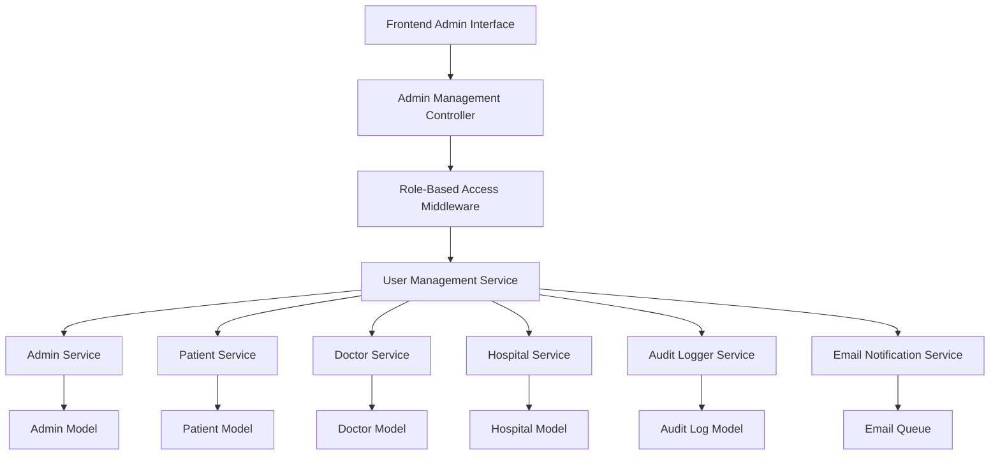
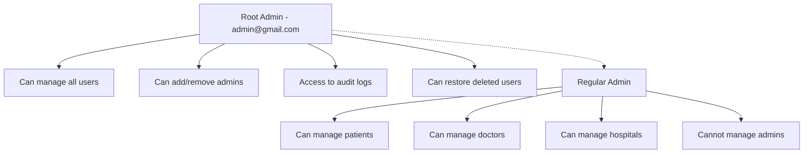
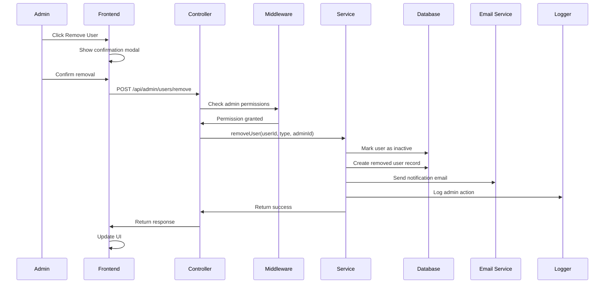
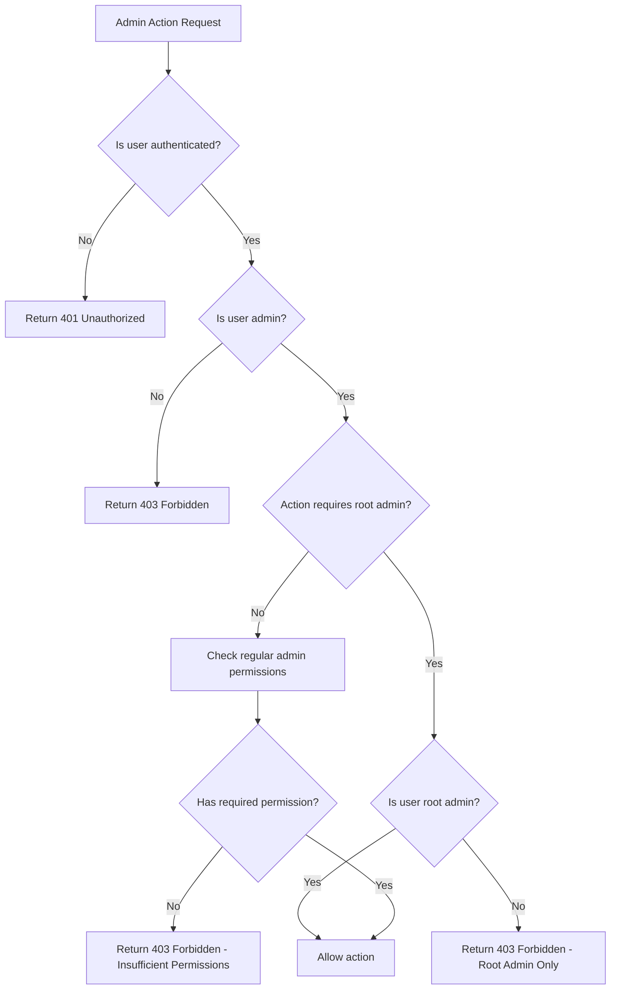

# Admin User Management System - Design Document

## Overview

The Admin User Management System implements a hierarchical admin structure with role-based permissions for managing users across the healthcare platform. The system establishes admin@gmail.com as the root admin with exclusive privileges for admin management, while regular admins can manage patients, doctors, and hospitals. The design emphasizes security, audit trails, and user data preservation.

## Architecture

### High-Level Architecture



### Permission Hierarchy



## Components and Interfaces

### 1. Backend Components

#### Admin Management Controller
```javascript
// backend/controllers/adminUserManagementController.js
class AdminUserManagementController {
  // Root admin only - Add new admin
  async addAdmin(req, res)
  
  // Remove users (role-based permissions)
  async removeUser(req, res)
  
  // Get users with role-based filtering
  async getUsers(req, res)
  
  // Root admin only - Get admin list
  async getAdmins(req, res)
  
  // Root admin only - Restore deleted user
  async restoreUser(req, res)
  
  // Get audit logs (root admin only)
  async getAuditLogs(req, res)
}
```

#### Role-Based Access Middleware
```javascript
// backend/middleware/adminRoleAuth.js
class AdminRoleMiddleware {
  // Check if user is root admin
  isRootAdmin(req, res, next)
  
  // Check if user is any admin
  isAdmin(req, res, next)
  
  // Check permissions for specific actions
  checkUserManagementPermission(req, res, next)
}
```

#### User Management Service
```javascript
// backend/services/userManagementService.js
class UserManagementService {
  // Remove user with data preservation
  async removeUser(userId, userType, adminId, reason)
  
  // Restore removed user
  async restoreUser(userId, userType, adminId)
  
  // Get users by type with filters
  async getUsersByType(userType, filters, adminRole)
  
  // Bulk user operations
  async bulkRemoveUsers(userIds, userType, adminId)
}
```

#### Audit Logger Service
```javascript
// backend/services/auditLoggerService.js
class AuditLoggerService {
  // Log admin actions
  async logAdminAction(adminId, action, targetUser, details)
  
  // Get audit logs with filters
  async getAuditLogs(filters, adminId)
  
  // Export audit logs
  async exportAuditLogs(filters, format)
}
```

### 2. Database Models

#### Enhanced Admin Model
```javascript
// backend/models/Admin.js
const adminSchema = new mongoose.Schema({
  name: { type: String, required: true },
  email: { type: String, required: true, unique: true },
  password: { type: String, required: true },
  isRootAdmin: { type: Boolean, default: false },
  isActive: { type: Boolean, default: true },
  lastLogin: { type: Date },
  createdBy: { type: mongoose.Schema.Types.ObjectId, ref: 'Admin' },
  permissions: [{
    resource: String, // 'patients', 'doctors', 'hospitals', 'admins'
    actions: [String] // 'read', 'create', 'update', 'delete'
  }]
}, { timestamps: true });
```

#### Audit Log Model
```javascript
// backend/models/AuditLog.js
const auditLogSchema = new mongoose.Schema({
  adminId: { type: mongoose.Schema.Types.ObjectId, ref: 'Admin', required: true },
  action: { type: String, required: true }, // 'USER_REMOVED', 'ADMIN_ADDED', etc.
  targetUserId: { type: mongoose.Schema.Types.ObjectId },
  targetUserType: { type: String }, // 'patient', 'doctor', 'hospital', 'admin'
  targetUserEmail: { type: String },
  details: {
    reason: String,
    ipAddress: String,
    userAgent: String,
    additionalData: mongoose.Schema.Types.Mixed
  },
  timestamp: { type: Date, default: Date.now }
});
```

#### Removed User Model
```javascript
// backend/models/RemovedUser.js
const removedUserSchema = new mongoose.Schema({
  originalId: { type: mongoose.Schema.Types.ObjectId, required: true },
  userType: { type: String, required: true },
  userData: { type: mongoose.Schema.Types.Mixed, required: true },
  removedBy: { type: mongoose.Schema.Types.ObjectId, ref: 'Admin', required: true },
  removedAt: { type: Date, default: Date.now },
  reason: { type: String },
  isRestored: { type: Boolean, default: false },
  restoredBy: { type: mongoose.Schema.Types.ObjectId, ref: 'Admin' },
  restoredAt: { type: Date },
  scheduledDeletion: { type: Date } // Auto-delete after 90 days
});
```

### 3. Frontend Components

#### Admin User Management Dashboard
```typescript
// frontend/src/app/components/admin-user-management/admin-user-management.component.ts
export class AdminUserManagementComponent {
  currentAdmin: Admin;
  isRootAdmin: boolean;
  selectedTab: string = 'patients';
  users: User[] = [];
  removedUsers: User[] = [];
  
  // Tab management
  switchTab(tab: string): void
  
  // User operations
  removeUser(user: User): void
  restoreUser(user: User): void
  bulkRemoveUsers(userIds: string[]): void
  
  // Admin-specific operations (root admin only)
  addNewAdmin(): void
  removeAdmin(admin: Admin): void
  
  // UI helpers
  canManageAdmins(): boolean
  canRemoveUser(user: User): boolean
}
```

#### User Removal Confirmation Modal
```typescript
// frontend/src/app/components/user-removal-modal/user-removal-modal.component.ts
export class UserRemovalModalComponent {
  user: User;
  confirmationText: string = '';
  reason: string = '';
  showWarnings: boolean = false;
  
  // Validation
  isConfirmationValid(): boolean
  
  // Actions
  confirmRemoval(): void
  cancel(): void
}
```

#### Add Admin Modal
```typescript
// frontend/src/app/components/add-admin-modal/add-admin-modal.component.ts
export class AddAdminModalComponent {
  adminForm: FormGroup;
  
  // Form validation
  validateForm(): boolean
  
  // Actions
  createAdmin(): void
  cancel(): void
}
```

## Data Models

### User Management Data Flow



### Admin Hierarchy Validation



## Error Handling

### Error Types and Responses

```javascript
// Error handling strategy
const AdminUserManagementErrors = {
  INSUFFICIENT_PERMISSIONS: {
    code: 'ADMIN_001',
    message: 'Insufficient permissions for this action',
    httpStatus: 403
  },
  ROOT_ADMIN_REQUIRED: {
    code: 'ADMIN_002',
    message: 'This action requires root admin privileges',
    httpStatus: 403
  },
  USER_NOT_FOUND: {
    code: 'ADMIN_003',
    message: 'User not found or already removed',
    httpStatus: 404
  },
  CANNOT_REMOVE_ROOT_ADMIN: {
    code: 'ADMIN_004',
    message: 'Root admin account cannot be removed',
    httpStatus: 400
  },
  ACTIVE_PROCESSES_EXIST: {
    code: 'ADMIN_005',
    message: 'User has active processes and cannot be removed',
    httpStatus: 409
  },
  DUPLICATE_ADMIN_EMAIL: {
    code: 'ADMIN_006',
    message: 'Admin with this email already exists',
    httpStatus: 409
  }
};
```

### Error Handling Middleware

```javascript
// backend/middleware/adminErrorHandler.js
const handleAdminErrors = (error, req, res, next) => {
  // Log error for audit
  auditLogger.logError(req.admin?.id, error, req);
  
  // Return appropriate error response
  if (error.code && error.code.startsWith('ADMIN_')) {
    return res.status(error.httpStatus).json({
      success: false,
      error: {
        code: error.code,
        message: error.message
      }
    });
  }
  
  // Handle unexpected errors
  return res.status(500).json({
    success: false,
    error: {
      code: 'ADMIN_INTERNAL_ERROR',
      message: 'An internal error occurred'
    }
  });
};
```

## Testing Strategy

### Unit Tests

1. **Admin Role Middleware Tests**
   - Test root admin identification
   - Test permission validation
   - Test unauthorized access prevention

2. **User Management Service Tests**
   - Test user removal with data preservation
   - Test user restoration functionality
   - Test bulk operations

3. **Audit Logger Tests**
   - Test action logging
   - Test log retrieval and filtering
   - Test log export functionality

### Integration Tests

1. **Admin Management Flow**
   - Test complete add admin workflow
   - Test admin removal by root admin
   - Test permission inheritance

2. **User Removal Flow**
   - Test user removal with confirmations
   - Test email notifications
   - Test audit trail creation

3. **Role-Based Access**
   - Test regular admin limitations
   - Test root admin privileges
   - Test cross-role access attempts

### End-to-End Tests

1. **Complete Admin Workflows**
   - Root admin adds new admin
   - Regular admin removes patient/doctor
   - Root admin removes another admin
   - User restoration workflow

2. **Security Tests**
   - Privilege escalation attempts
   - Unauthorized access attempts
   - Session validation

### API Endpoints

```javascript
// Admin User Management Routes
POST   /api/admin/users/add-admin          // Root admin only
DELETE /api/admin/users/:id/remove         // Role-based permissions
POST   /api/admin/users/:id/restore        // Root admin only
GET    /api/admin/users                    // Role-based filtering
GET    /api/admin/users/removed            // Root admin only
GET    /api/admin/audit-logs               // Root admin only
POST   /api/admin/users/bulk-remove        // Role-based permissions
```

### Security Considerations

1. **Authentication & Authorization**
   - JWT token validation for all admin endpoints
   - Role-based permission checking
   - Session timeout and refresh handling

2. **Data Protection**
   - Soft deletion for user data preservation
   - Encrypted audit logs
   - Secure email notifications

3. **Rate Limiting**
   - Limit admin management actions per hour
   - Progressive delays for failed attempts
   - IP-based restrictions for sensitive operations

4. **Audit Trail**
   - Complete logging of all admin actions
   - Immutable audit records
   - Regular audit log backups

This design provides a comprehensive, secure, and scalable solution for admin user management with proper role-based access control and data preservation mechanisms.