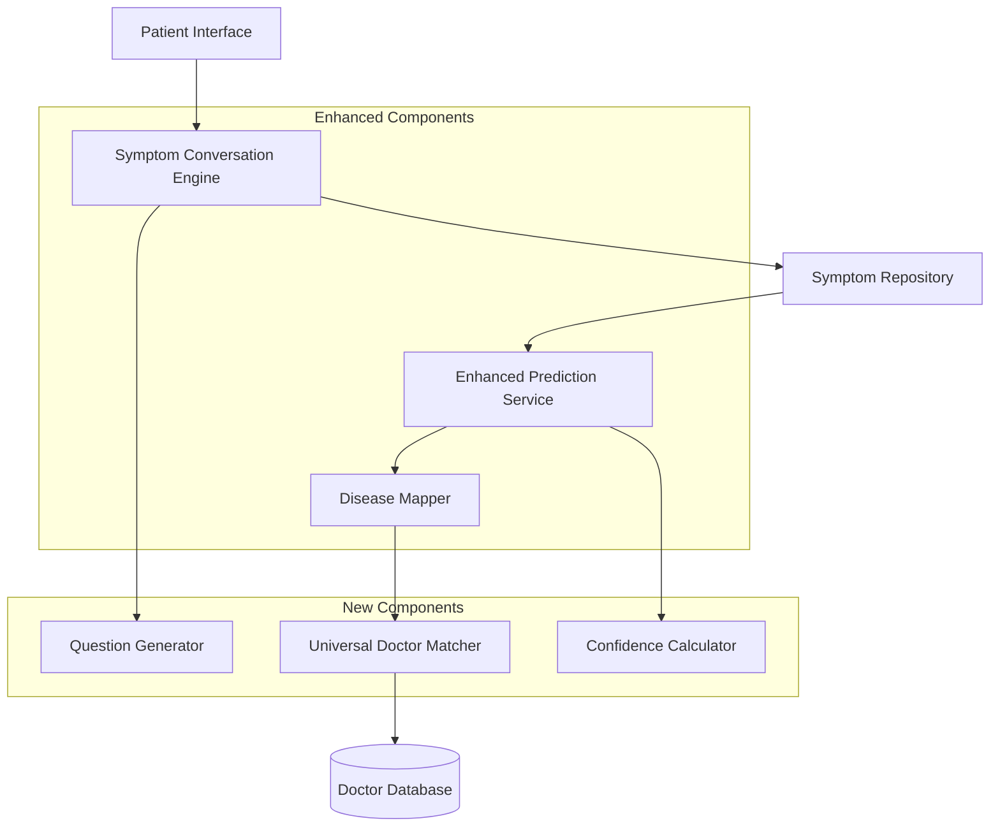
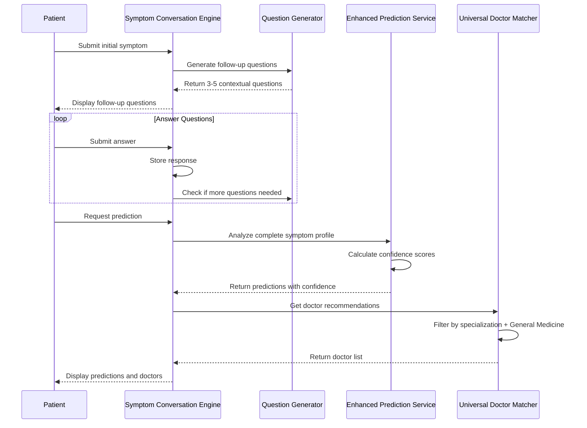

# Design Document

## Overview

This design document outlines the architecture for an intelligent symptom analysis system that uses multi-step questioning to gather comprehensive patient information before generating disease predictions. The system will enhance doctor matching by introducing a "General Medicine" category that serves as a universal fallback, ensuring patients always have access to appropriate medical care.

The solution consists of three main components:
1. **Symptom Conversation Engine**: Manages multi-step symptom gathering with contextual follow-up questions
2. **Enhanced Prediction Service**: Analyzes complete symptom profiles with confidence scoring
3. **Universal Doctor Matcher**: Implements General Medicine category logic for doctor recommendations

## Architecture

### High-Level Architecture



### Component Interaction Flow



## Components and Interfaces

### 1. Symptom Conversation Engine

**Purpose**: Orchestrates the multi-step symptom gathering process

**Location**: `backend/services/symptomConversationService.js`

**Key Methods**:
```javascript
class SymptomConversationService {
  // Initialize a new symptom conversation session
  async startConversation(patientId, initialSymptom)
  
  // Get next follow-up questions based on current state
  async getFollowUpQuestions(conversationId)
  
  // Store patient's answer and update conversation state
  async submitAnswer(conversationId, questionId, answer)
  
  // Check if enough information collected for prediction
  canProceedToPrediction(conversationId)
  
  // Generate final symptom profile for prediction
  async generateSymptomProfile(conversationId)
  
  // Get conversation history
  async getConversationHistory(conversationId)
}
```

**Data Structure**:
```javascript
{
  conversationId: String,
  patientId: ObjectId,
  initialSymptom: String,
  symptomCategory: String, // respiratory, cardiovascular, etc.
  questions: [{
    questionId: String,
    questionText: String,
    questionType: String, // multiple_choice, yes_no, scale, text
    options: [String], // for multiple choice
    askedAt: Date
  }],
  answers: [{
    questionId: String,
    answer: String,
    answeredAt: Date
  }],
  extractedSymptoms: [String],
  status: String, // active, completed, abandoned
  createdAt: Date,
  updatedAt: Date
}
```

### 2. Question Generator

**Purpose**: Generates contextual follow-up questions based on symptom categories

**Location**: `backend/services/questionGenerator.js`

**Key Methods**:
```javascript
class QuestionGenerator {
  // Generate questions for a specific symptom category
  generateQuestionsForCategory(category, existingAnswers)
  
  // Get question templates by category
  getQuestionTemplates(category)
  
  // Filter out already asked questions
  filterAskedQuestions(questions, conversationHistory)
  
  // Prioritize questions based on diagnostic value
  prioritizeQuestions(questions, symptomProfile)
}
```

**Question Templates by Category**:
```javascript
const QUESTION_TEMPLATES = {
  respiratory: [
    {
      id: 'resp_001',
      text: 'How long have you had this symptom?',
      type: 'multiple_choice',
      options: ['Less than 24 hours', '1-3 days', '4-7 days', 'More than a week']
    },
    {
      id: 'resp_002',
      text: 'Do you have a fever?',
      type: 'yes_no'
    },
    {
      id: 'resp_003',
      text: 'On a scale of 1-10, how severe is your breathing difficulty?',
      type: 'scale',
      min: 1,
      max: 10
    },
    {
      id: 'resp_004',
      text: 'Is your cough dry or producing mucus?',
      type: 'multiple_choice',
      options: ['Dry cough', 'Mucus/phlegm', 'Not applicable']
    },
    {
      id: 'resp_005',
      text: 'Do you have chest pain or tightness?',
      type: 'yes_no'
    }
  ],
  cardiovascular: [
    {
      id: 'cardio_001',
      text: 'Where exactly is the chest pain located?',
      type: 'multiple_choice',
      options: ['Center of chest', 'Left side', 'Right side', 'Radiating to arm/jaw']
    },
    {
      id: 'cardio_002',
      text: 'How long does the pain last?',
      type: 'multiple_choice',
      options: ['Few seconds', 'Few minutes', '30+ minutes', 'Constant']
    },
    {
      id: 'cardio_003',
      text: 'Do you feel shortness of breath?',
      type: 'yes_no'
    },
    {
      id: 'cardio_004',
      text: 'Do you experience palpitations or irregular heartbeat?',
      type: 'yes_no'
    },
    {
      id: 'cardio_005',
      text: 'Does the pain worsen with physical activity?',
      type: 'yes_no'
    }
  ],
  gastrointestinal: [
    {
      id: 'gi_001',
      text: 'Where is the pain located?',
      type: 'multiple_choice',
      options: ['Upper abdomen', 'Lower abdomen', 'Around navel', 'Entire abdomen']
    },
    {
      id: 'gi_002',
      text: 'When does the pain occur?',
      type: 'multiple_choice',
      options: ['After eating', 'Before eating', 'No pattern', 'At night']
    },
    {
      id: 'gi_003',
      text: 'Do you have nausea or vomiting?',
      type: 'yes_no'
    },
    {
      id: 'gi_004',
      text: 'Have you noticed changes in bowel movements?',
      type: 'multiple_choice',
      options: ['Diarrhea', 'Constipation', 'Both', 'No change']
    },
    {
      id: 'gi_005',
      text: 'Is there bloating or gas?',
      type: 'yes_no'
    }
  ],
  neurological: [
    {
      id: 'neuro_001',
      text: 'What type of headache do you have?',
      type: 'multiple_choice',
      options: ['Throbbing/pulsating', 'Pressure/tightness', 'Sharp/stabbing', 'Dull ache']
    },
    {
      id: 'neuro_002',
      text: 'Where is the headache located?',
      type: 'multiple_choice',
      options: ['One side', 'Both sides', 'Forehead', 'Back of head']
    },
    {
      id: 'neuro_003',
      text: 'Do you have sensitivity to light or sound?',
      type: 'yes_no'
    },
    {
      id: 'neuro_004',
      text: 'Have you experienced vision changes?',
      type: 'yes_no'
    },
    {
      id: 'neuro_005',
      text: 'Do you feel dizzy or have balance problems?',
      type: 'yes_no'
    }
  ],
  musculoskeletal: [
    {
      id: 'msk_001',
      text: 'Which joints are affected?',
      type: 'multiple_choice',
      options: ['Knees', 'Hips', 'Shoulders', 'Hands/fingers', 'Multiple joints']
    },
    {
      id: 'msk_002',
      text: 'Is there swelling or redness?',
      type: 'yes_no'
    },
    {
      id: 'msk_003',
      text: 'When is the pain worse?',
      type: 'multiple_choice',
      options: ['Morning', 'After activity', 'At rest', 'Night time']
    },
    {
      id: 'msk_004',
      text: 'Do you have stiffness?',
      type: 'yes_no'
    },
    {
      id: 'msk_005',
      text: 'Have you had any recent injury?',
      type: 'yes_no'
    }
  ],
  general: [
    {
      id: 'gen_001',
      text: 'How long have you had these symptoms?',
      type: 'multiple_choice',
      options: ['Less than 24 hours', '1-3 days', '4-7 days', 'More than a week']
    },
    {
      id: 'gen_002',
      text: 'Have you taken any medication for this?',
      type: 'yes_no'
    },
    {
      id: 'gen_003',
      text: 'Do you have any chronic conditions?',
      type: 'yes_no'
    },
    {
      id: 'gen_004',
      text: 'On a scale of 1-10, how would you rate your overall discomfort?',
      type: 'scale',
      min: 1,
      max: 10
    }
  ]
};
```

### 3. Enhanced Prediction Service

**Purpose**: Analyzes complete symptom profiles and generates predictions with confidence scores

**Location**: `backend/services/enhancedPredictionService.js`

**Key Methods**:
```javascript
class EnhancedPredictionService {
  // Analyze symptom profile and generate predictions
  async analyzeSymptomsWithConfidence(symptomProfile)
  
  // Calculate confidence score based on symptom matches
  calculateConfidenceScore(disease, symptomProfile)
  
  // Get disease predictions sorted by confidence
  getPredictionsWithConfidence(symptoms, answers)
  
  // Update predictions when new answers are added
  async recalculatePredictions(conversationId)
}
```

**Confidence Calculation Algorithm**:
```javascript
function calculateConfidence(disease, symptomProfile) {
  let score = 0;
  const weights = {
    primarySymptom: 40,      // Initial symptom match
    secondarySymptoms: 30,   // Additional symptom matches
    followUpAnswers: 20,     // Relevant follow-up answers
    duration: 10             // Symptom duration factor
  };
  
  // Primary symptom match
  if (disease.primarySymptoms.includes(symptomProfile.initialSymptom)) {
    score += weights.primarySymptom;
  }
  
  // Secondary symptom matches
  const matchedSecondary = symptomProfile.extractedSymptoms.filter(
    s => disease.secondarySymptoms.includes(s)
  );
  score += (matchedSecondary.length / disease.secondarySymptoms.length) * weights.secondarySymptoms;
  
  // Follow-up answer relevance
  const relevantAnswers = analyzeAnswerRelevance(disease, symptomProfile.answers);
  score += relevantAnswers * weights.followUpAnswers;
  
  // Duration factor
  score += calculateDurationFactor(disease, symptomProfile.duration) * weights.duration;
  
  return Math.min(Math.round(score), 100);
}
```

### 4. Universal Doctor Matcher

**Purpose**: Implements doctor filtering logic with General Medicine category support

**Location**: `backend/services/universalDoctorMatcher.js`

**Key Methods**:
```javascript
class UniversalDoctorMatcher {
  // Get doctors matching specializations with General Medicine fallback
  async getDoctorsForConditions(predictedConditions, patientLocation)
  
  // Check if doctor is General Medicine category
  isGeneralMedicineDoctor(doctor)
  
  // Filter and sort doctors by relevance
  sortDoctorsByRelevance(doctors, specializations)
  
  // Ensure at least one doctor is returned
  async ensureMinimumDoctors(doctors, patientLocation)
}
```

**Doctor Filtering Logic**:
```javascript
async function getDoctorsForConditions(predictedConditions, patientLocation) {
  // Get required specializations from predictions
  const specializations = getSpecializationsForDiseases(predictedConditions);
  
  // Build query: doctors with matching specializations OR General Medicine
  const query = {
    subscriptionStatus: 'active',
    isActive: true,
    $or: [
      { specializations: { $in: specializations } },
      { specializations: { $in: ['General Medicine'] } }
    ]
  };
  
  // Fetch doctors
  let doctors = await Doctor.find(query)
    .select('name email degree specializations rating experienceYears contactNumber clinicAddress')
    .sort({ rating: -1, experienceYears: -1 });
  
  // Sort: specialized doctors first, then General Medicine
  doctors = sortDoctorsByRelevance(doctors, specializations);
  
  // Ensure at least one doctor (fallback to any General Medicine doctor)
  if (doctors.length === 0) {
    doctors = await Doctor.find({
      specializations: { $in: ['General Medicine'] },
      subscriptionStatus: 'active',
      isActive: true
    }).limit(5);
  }
  
  return doctors;
}

function sortDoctorsByRelevance(doctors, targetSpecializations) {
  return doctors.sort((a, b) => {
    // Check if doctor has target specialization
    const aHasTarget = a.specializations.some(s => targetSpecializations.includes(s));
    const bHasTarget = b.specializations.some(s => targetSpecializations.includes(s));
    
    // Specialized doctors come first
    if (aHasTarget && !bHasTarget) return -1;
    if (!aHasTarget && bHasTarget) return 1;
    
    // Within same category, sort by rating then experience
    if (a.rating !== b.rating) return b.rating - a.rating;
    return b.experienceYears - a.experienceYears;
  });
}
```

### 5. Database Cleanup Utility

**Purpose**: Safely remove non-essential data while preserving system integrity

**Location**: `backend/scripts/cleanupDatabase.js`

**Key Methods**:
```javascript
async function cleanupDatabase(options = {}) {
  const {
    removeMessages = true,
    removeConversations = true,
    removeCases = false,  // Keep cases by default for medical records
    dryRun = false
  } = options;
  
  const results = {
    messagesRemoved: 0,
    conversationsRemoved: 0,
    casesRemoved: 0,
    errors: []
  };
  
  try {
    // Remove messages
    if (removeMessages) {
      const messageResult = await Message.deleteMany({});
      results.messagesRemoved = messageResult.deletedCount;
    }
    
    // Remove symptom conversations
    if (removeConversations) {
      const convResult = await SymptomConversation.deleteMany({});
      results.conversationsRemoved = convResult.deletedCount;
    }
    
    // Optionally remove cases (with confirmation)
    if (removeCases) {
      const caseResult = await Case.deleteMany({});
      results.casesRemoved = caseResult.deletedCount;
    }
    
    // Clear extracted symptoms from patient records
    await Patient.updateMany(
      {},
      { $set: { extractedSymptoms: [] } }
    );
    
    return results;
  } catch (error) {
    results.errors.push(error.message);
    throw error;
  }
}
```

**Preserved Data**:
- User accounts (Patient, Doctor, Admin)
- Hospital information
- Doctor profiles and specializations
- Subscription data
- System configuration
- Audit logs

## Data Models

### SymptomConversation Model

**Location**: `backend/models/SymptomConversation.js`

```javascript
const symptomConversationSchema = new mongoose.Schema({
  patientId: {
    type: mongoose.Schema.Types.ObjectId,
    ref: 'Patient',
    required: true,
    index: true
  },
  initialSymptom: {
    type: String,
    required: true,
    trim: true
  },
  symptomCategory: {
    type: String,
    enum: ['respiratory', 'cardiovascular', 'gastrointestinal', 'neurological', 'musculoskeletal', 'dermatological', 'general'],
    required: true
  },
  questions: [{
    questionId: String,
    questionText: String,
    questionType: {
      type: String,
      enum: ['multiple_choice', 'yes_no', 'scale', 'text']
    },
    options: [String],
    askedAt: {
      type: Date,
      default: Date.now
    }
  }],
  answers: [{
    questionId: String,
    answer: String,
    answeredAt: {
      type: Date,
      default: Date.now
    }
  }],
  extractedSymptoms: [String],
  predictions: [{
    disease: String,
    confidence: Number,
    specializations: [String],
    calculatedAt: Date
  }],
  recommendedDoctors: [{
    doctorId: {
      type: mongoose.Schema.Types.ObjectId,
      ref: 'Doctor'
    },
    relevanceScore: Number,
    isGeneralMedicine: Boolean
  }],
  status: {
    type: String,
    enum: ['active', 'completed', 'abandoned'],
    default: 'active'
  },
  completedAt: Date
}, {
  timestamps: true
});

symptomConversationSchema.index({ patientId: 1, status: 1 });
symptomConversationSchema.index({ createdAt: -1 });
```

### Enhanced Case Model Updates

**Location**: `backend/models/Case.js` (modifications)

```javascript
// Add to existing Case schema
symptomConversationId: {
  type: mongoose.Schema.Types.ObjectId,
  ref: 'SymptomConversation'
},
predictionConfidence: [{
  condition: String,
  confidence: Number
}]
```

## Error Handling

### Conversation Errors
- **Incomplete Conversation**: If patient abandons conversation, mark as abandoned after 24 hours
- **Invalid Answers**: Validate answer format matches question type
- **Missing Questions**: Fallback to general questions if category-specific questions unavailable

### Prediction Errors
- **Low Confidence**: Display disclaimer when all predictions below 50% confidence
- **No Predictions**: Fallback to General Medicine recommendation
- **Service Unavailable**: Cache last successful prediction templates

### Doctor Matching Errors
- **No Doctors Found**: Always fallback to General Medicine doctors
- **Inactive Doctors**: Filter out doctors with expired subscriptions
- **Location Unavailable**: Return doctors without location filtering

## Testing Strategy

### Unit Tests

1. **Question Generator Tests**
   - Test question generation for each category
   - Verify question filtering logic
   - Test question prioritization

2. **Confidence Calculator Tests**
   - Test confidence scoring algorithm
   - Verify score boundaries (0-100)
   - Test with various symptom combinations

3. **Doctor Matcher Tests**
   - Test General Medicine fallback logic
   - Verify specialization filtering
   - Test doctor sorting algorithm

### Integration Tests

1. **Complete Conversation Flow**
   - Test full symptom gathering process
   - Verify prediction generation
   - Test doctor recommendation

2. **Database Cleanup**
   - Test cleanup script with dry-run
   - Verify data preservation
   - Test rollback scenarios

### End-to-End Tests

1. **Patient Journey**
   - Submit initial symptom
   - Answer follow-up questions
   - Receive predictions with confidence
   - View recommended doctors (specialized + General Medicine)
   - Create case with selected doctor

2. **Doctor View**
   - View case with complete symptom conversation history
   - See confidence scores for predictions
   - Access full Q&A transcript

## Performance Considerations

### Caching Strategy
- Cache question templates in memory
- Cache disease-specialization mappings
- Cache General Medicine doctor list (refresh every 5 minutes)

### Database Optimization
- Index on `symptomConversationId` in Case model
- Index on `specializations` in Doctor model
- Compound index on `patientId` and `status` in SymptomConversation

### Query Optimization
- Limit doctor queries to active subscriptions only
- Use projection to fetch only required doctor fields
- Batch fetch related data (populate) in single query

## Security Considerations

- Validate all user inputs for follow-up answers
- Sanitize symptom text to prevent injection attacks
- Ensure patients can only access their own conversations
- Encrypt sensitive medical data in symptom conversations
- Audit log all database cleanup operations

## Migration Strategy

### Phase 1: Add New Models
- Deploy SymptomConversation model
- Add indexes
- No impact on existing functionality

### Phase 2: Deploy New Services
- Deploy Question Generator
- Deploy Enhanced Prediction Service
- Deploy Universal Doctor Matcher
- Keep existing services running in parallel

### Phase 3: Update Frontend
- Add conversation UI components
- Update prediction display with confidence scores
- Update doctor list to show General Medicine doctors

### Phase 4: Migrate Existing Data
- Run database cleanup script (optional)
- Update existing cases to reference new conversation model
- Backfill confidence scores for existing predictions

### Phase 5: Deprecate Old Services
- Monitor new system for 1 week
- Gradually route all traffic to new services
- Remove old prediction service code
